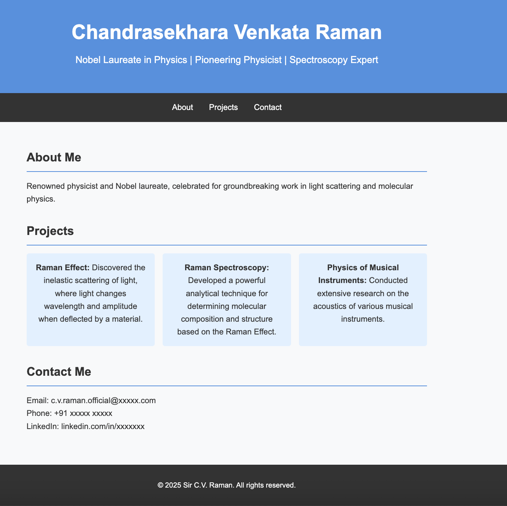

# Master HTML/CSS from Scratch : Build & Deploy Your Portfolio 🚀  

*A step-by-step beginner's guide to building and deploying a professional portfolio website using pure HTML and CSS.*  

  

## 📌 Course Overview  
This project-based course teaches HTML/CSS fundamentals by building a **fully responsive portfolio website** from scratch. Perfect for:  
- Absolute beginners in web development  
- College students building their first portfolio  
- Developers needing a refresher on core concepts  

## 🛠 What You'll Learn  
✅ **HTML5** semantic structure  
✅ **CSS3** styling and layouts (Flexbox/Grid)  
✅ **Responsive Design** (Mobile-first approach)  
✅ **Deployment** (GitHub Pages)  

## 📂 Project Structure  
```plaintext
portfolio-project/
├── index.html          # Main HTML file
├── styles.css          # All CSS styles
├── assets/             # Images/icons
│   ├── profile.jpg     
│   └── project.png   
└── README.md           # This file
```

## 🚀 Getting Started

1. Clone the repository:
```bash
git clone https://github.com/prasunchakra/dev-portfolio.git
```

2. Open `index.html` in your browser

3. Follow the step-by-step lessons (links below)

## 📚 Step-by-Step Lessons
HTML Foundations

Build the skeleton of your portfolio

CSS Styling

Add colors, fonts, and basic layouts

Advanced Layouts

Implement Flexbox and Grid

Responsive Design

Make it mobile-friendly

Deployment

Go live with GitHub Pages

## 🌟 Final Outcome
By the end, you'll have:

A personal portfolio website showcasing your skills/projects

Hands-on experience with real-world HTML/CSS

A live URL to share with employers!

## 🤝 How to Contribute
Found a bug or want to improve the course?

Fork the repo

Create a branch (git checkout -b feature/improvement)

Commit changes (git commit -m 'Add new feature')

Push to branch (git push origin feature/improvement)

Open a Pull Request

## 📜 License
This project is licensed under the MIT License.

